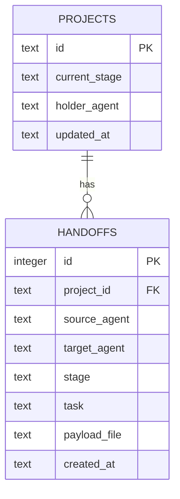

# DB Schema — SQLite Index

> **สำคัญ:** ตารางเหล่านี้เป็น **index ที่ rebuild ได้เสมอ** ไม่ใช่ source of truth
> ข้อมูลจริงอยู่ในไฟล์ `.ao/handoffs/*.json` และ `.ao/state.json` — ลบ `.ao/index.db` ทิ้งแล้วรัน
> `ao log --reindex` ก็ได้ข้อมูลกลับมาครบ (ดู `internal/orchestrator.Reindex`)

ที่ตั้งไฟล์: `.ao/index.db` ต่อโปรเจกต์ (ไม่ commit เข้า git — อยู่ใน `.gitignore`)
Driver: `modernc.org/sqlite` (pure-Go, ไม่ต้องพึ่ง CGO/libsqlite3)

## ER Diagram

## `projects`

สถานะล่าสุดของแต่ละโปรเจกต์ (upsert ทุกครั้งที่มี handoff ใหม่)

| Column | Type | คำอธิบาย |
|---|---|---|
| `id` | TEXT PK | = `project_id` |
| `current_stage` | TEXT | stage ปัจจุบัน |
| `holder_agent` | TEXT | agent ที่ถือไม้อยู่ตอนนี้ (= `target_agent` ของ handoff ล่าสุด) |
| `updated_at` | TEXT (RFC3339) | เวลาของ handoff ล่าสุด |

## `handoffs`

ประวัติการส่งไม้ต่อทั้งหมด แต่ละแถวสอดคล้องกับไฟล์หนึ่งใน `.ao/handoffs/`

| Column | Type | คำอธิบาย |
|---|---|---|
| `id` | INTEGER PK AUTOINCREMENT | ลำดับ index ภายใน (ไม่ใช่ลำดับในชื่อไฟล์) |
| `project_id` | TEXT | อ้างอิง `projects.id` |
| `source_agent` | TEXT | agent ที่ส่ง |
| `target_agent` | TEXT | agent ที่รับ |
| `stage` | TEXT | stage ณ ตอนส่ง |
| `task` | TEXT | `payload.task` |
| `payload_file` | TEXT | path relative ของไฟล์ envelope เต็ม เช่น `.ao/handoffs/003-claude-code-to-antigravity-ide.json` |
| `created_at` | TEXT (RFC3339) | = `metadata.timestamp` ของ envelope |

Index: `idx_handoffs_project (project_id, created_at)` สำหรับ `ao log` ที่ query ตาม project

## เหตุผลที่ไม่ใช้ PostgreSQL ตั้งแต่แรก

`internal/store.Store` เป็น interface — `SQLiteStore` (Phase 1) implement มันแบบเดียวกับที่
`PostgresStore` (Phase 3, สำหรับ K3s) จะ implement ในอนาคต โค้ดชั้น `orchestrator` และ MCP
tools ไม่ต้องแก้เลยตอนสลับ storage
